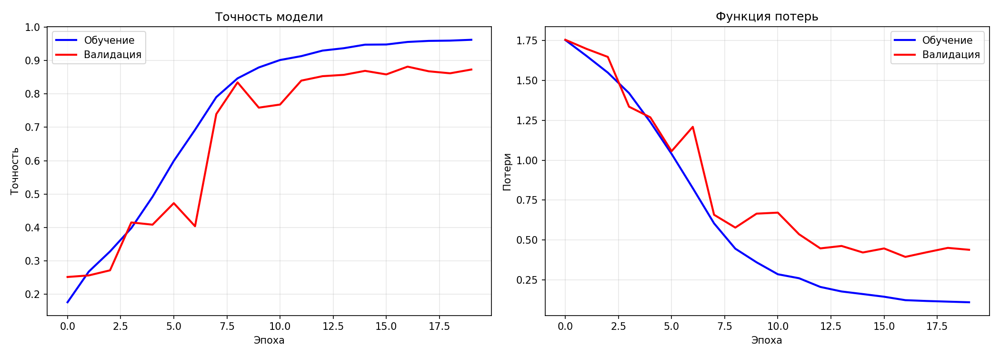

# GenreNeuro — Классификатор жанров детских книг

Нейросетевой классификатор, который автоматически определяет жанр детской книги по её текстовому описанию. Построен на TensorFlow/Keras с использованием архитектуры Embedding + GlobalAveragePooling + Dense.

## Жанры

Модель различает **6 жанров**:

| Жанр | Кол-во | Доля |
|------|--------|------|
| Проза | 2 855 | 30.3% |
| Сказка | 1 992 | 21.2% |
| Приключения | 1 853 | 19.7% |
| Образовательная литература | 1 122 | 11.9% |
| Стихи | 1 084 | 11.5% |
| Подростковая | 503 | 5.3% |

## Результаты

- **Точность на тесте**: 89.16%
- **Baseline** (предсказание самого частого класса): 30.3%
- **Прирост над baseline**: +58.9%

Переобучение снижено до ~7% (train ~96%, test ~89%) благодаря Dropout(0.3), class_weight и EarlyStopping. Датасет: 9 409 записей.

<details>
<summary>Графики обучения</summary>



Левый график — точность (accuracy), правый — функция потерь (loss). Синяя линия — обучающая выборка, красная — валидационная.
</details>

## Архитектура модели

```
Input (200 tokens) → Embedding(10000, 64) → GlobalAveragePooling1D → Dense(64, ReLU) → Dropout(0.3) → Dense(6, Softmax)
```

| Слой | Выход | Параметры |
|------|-------|-----------|
| Embedding | (None, 200, 64) | 640 000 |
| GlobalAveragePooling1D | (None, 64) | 0 |
| Dense (ReLU) | (None, 64) | 4 160 |
| Dropout (0.3) | (None, 64) | 0 |
| Dense (Softmax) | (None, 6) | 390 |
| **Итого** | | **644 550** |

## Быстрый старт

### Установка

```bash
git clone https://github.com/laviercasey/GenreNeuro.git
cd GenreNeuro

python -m venv venv
# Windows:
venv\Scripts\activate
# Linux/macOS:
source venv/bin/activate

pip install -r requirements.txt
```

### Обучение модели

```bash
python train.py
```

Скрипт:
1. Загружает датасет `dataset.json`
2. Очищает тексты (lowercase, удаление спецсимволов, HTML, URL)
3. Токенизирует и паддит последовательности
4. Обучает нейросеть (до 20 эпох с EarlyStopping)
5. Сохраняет модель и артефакты:
   - `model.keras` — обученная модель
   - `tokenizer.pkl` — токенизатор
   - `label_encoder.pkl` — энкодер меток
   - `model_params.pkl` — параметры модели
   - `training_history.png` — графики обучения

### Тестирование и использование

```bash
python test.py
```

Скрипт прогоняет 8 тестовых примеров и запускает **интерактивный режим** — можно вводить произвольные описания книг и получать предсказания с распределением вероятностей по жанрам.

Пример вывода:
```
────────────────────────────────────────────────────────────
Текст: Волшебная история о маленькой принцессе в заколдованном замке...
────────────────────────────────────────────────────────────

Жанр: Сказка (89.0%)

Распределение:
  Сказка                    [██████████████████████████░░░░]  89.0% <-
  Проза                     [██░░░░░░░░░░░░░░░░░░░░░░░░░░░░]   6.1%
  Приключения               [█░░░░░░░░░░░░░░░░░░░░░░░░░░░░░]   3.2%
  ...
```

## Структура проекта

```
GenreNeuro/
├── train.py              # Обучение модели
├── test.py               # Тестирование и интерактивный режим
├── requirements.txt      # Зависимости проекта
├── dataset.json          # Датасет (9 409 записей)
├── REPORT.md             # Подробный технический отчёт
├── training_history.png  # Графики обучения
├── model.keras           # Обученная модель
├── tokenizer.pkl         # Токенизатор
├── label_encoder.pkl     # Энкодер меток
└── model_params.pkl      # Параметры модели
```

## Гиперпараметры

| Параметр | Значение |
|----------|----------|
| Размер словаря | 10 000 |
| Макс. длина последовательности | 200 |
| Размерность эмбеддинга | 64 |
| Batch size | 32 |
| Эпох | до 20 (EarlyStopping, patience=3) |
| Оптимизатор | Adam (lr=0.001) |
| Loss | Categorical Crossentropy |

## Предобработка текста

1. Приведение к нижнему регистру
2. Удаление URL (`http://`, `https://`, `www.`)
3. Удаление HTML-тегов
4. Удаление спецсимволов (оставляем только кириллицу, латиницу и пробелы)
5. Нормализация пробелов

## Возможные улучшения

1. **LSTM/GRU** — учёт порядка слов в последовательности
2. **Увеличение словаря** до 20-50K слов
3. **Более глубокая архитектура**: Dense(128) → Dense(64) → Dense(6)
4. **Предобученные эмбеддинги** (Word2Vec, FastText для русского языка)
5. **Трансформеры** (RuBERT) — потенциальный прирост точности на 5-10%

Подробный разбор каждого улучшения с математическими обоснованиями — в [REPORT.md](REPORT.md).

## Технологии

- Python 3.10+
- TensorFlow / Keras
- scikit-learn
- NumPy
- Matplotlib

## Лицензия

MIT
Проект создан в учебных целях. Свободен для использования и модификации.
